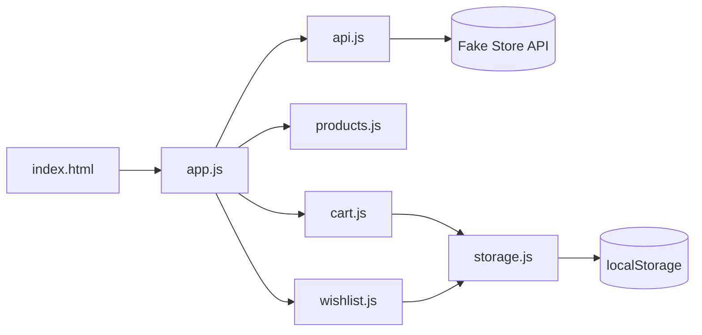

# NovaCart

A modern, interview-ready e-commerce storefront built entirely with **vanilla JavaScript** — no frameworks, no build step, no backend.

Browse products from the [Fake Store API](https://fakestoreapi.com), filter by category, manage a slide-in cart and wishlist, and enjoy polish like skeleton loading, toast notifications, dark mode, and fake authentication — all persisted in `localStorage`.

---

## Preview

> Add a screenshot or GIF here after deploying or recording your app.

```text
┌─────────────────────────────────────────────────────────┐
│  NovaCart    [ Search... ▼ ]     🌙  ❤️  Login  🛒 Cart │
├─────────────────────────────────────────────────────────┤
│              Discover Premium Products                  │
├─────────────────────────────────────────────────────────┤
│  [All] [electronics] [jewelery] [men's clothing] ...    │
│                                                         │
│   ┌──────┐  ┌──────┐  ┌──────┐  ┌──────┐               │
│   │ card │  │ card │  │ card │  │ card │               │
│   └──────┘  └──────┘  └──────┘  └──────┘               │
└─────────────────────────────────────────────────────────┘
```

---

## Features

### Core

| Feature | Description |
|--------|-------------|
| **Product listing** | Grid of products fetched from Fake Store API |
| **Search** | Real-time title filtering |
| **Category filters** | Dynamic chips from API categories |
| **Quick view modal** | Image, description, price, add to cart |
| **Cart** | Add items, update quantity, remove, live total |
| **Wishlist** | Save favorites with heart toggle + sidebar |
| **Responsive UI** | Mobile-friendly layout and sidebars |
| **Dark mode** | Theme toggle with persistence |
| **localStorage** | Cart, wishlist, user session, and theme saved locally |

### Advanced

| Feature | Description |
|--------|-------------|
| **Skeleton loading** | Shimmer placeholders while products load |
| **Toast notifications** | Feedback for cart, wishlist, auth actions |
| **Search suggestions** | Autocomplete dropdown as you type |
| **Cart sidebar** | Slide-in drawer with overlay |
| **Fake authentication** | Login UI; user stored in `localStorage` (demo only) |

---

## Tech stack

| Layer | Technology |
|-------|------------|
| Markup | HTML5 |
| Styling | CSS3 (custom properties, Grid, Flexbox) |
| Logic | ES6 modules (vanilla JavaScript) |
| Data | [Fake Store API](https://fakestoreapi.com) |
| Storage | Browser `localStorage` |

**No** React, Vue, npm dependencies, or bundler required.

---

## Getting started

### Prerequisites

- A modern browser (Chrome, Firefox, Edge, Safari)
- A local static server (recommended — ES modules need `http://`, not `file://`)

### Run locally

**Option 1 — VS Code Live Server**

1. Clone the repository.
2. Open the project folder in VS Code.
3. Right-click `index.html` → **Open with Live Server**.

**Option 2 — npx serve**

```bash
git clone https://github.com/YOUR_USERNAME/novacart.git
cd novacart
npx serve .
```

Then open the URL shown in the terminal (usually `http://localhost:3000`).

**Option 3 — Python**

```bash
# Python 3
python -m http.server 8080
```

Visit `http://localhost:8080`.

---

## Project structure

```text
novacart/
├── index.html          # App shell & layout
├── style.css           # Global styles, themes, components
├── README.md
└── js/
    ├── app.js          # Entry point & orchestration
    ├── api.js          # Fake Store API fetch
    ├── products.js     # Product cards & rendering
    ├── cart.js         # Cart logic & sidebar
    ├── wishlist.js     # Wishlist logic & sidebar
    ├── search.js       # Search filter helper
    ├── suggestions.js  # Search autocomplete
    ├── categories.js   # Category filter chips
    ├── modal.js        # Quick view modal
    ├── auth.js         # Fake login / logout
    ├── theme.js        # Dark / light mode
    ├── skeleton.js     # Loading placeholders
    ├── storage.js      # localStorage helpers
    └── ui.js           # Toast notifications
```

---

## How it works



1. **`app.js`** shows skeleton loaders, fetches products, and wires search, filters, and UI init.
2. **`products.js`** renders the grid; quick view and wishlist actions open modals or update storage.
3. **`cart.js`** / **`wishlist.js`** read and write via **`storage.js`**.
4. Theme and fake auth state are also persisted for a consistent return visit.

### localStorage keys

| Key | Purpose |
|-----|---------|
| `novacart_cart` | Cart items with quantities |
| `novacart_wishlist` | Saved products |
| `novacart_user` | Logged-in user (demo) |
| `novacart_theme` | `light` or `dark` |

---

## API

Products are loaded from:

```text
GET https://fakestoreapi.com/products
```

Each product includes `id`, `title`, `price`, `description`, `category`, and `image`.

---

## Usage tips

- **Search** — Type in the navbar; pick a suggestion or keep typing to filter the grid.
- **Categories** — Click **All** or any category chip to narrow results.
- **Quick view** — Click **Quick View** or the product image.
- **Cart** — Use **+** / **−** in the sidebar; trash icon removes the line item.
- **Wishlist** — Click the heart on a card; open **❤️** in the nav to manage saved items.
- **Login** — Any email/password works (client-side demo only; not secure for production).

---

## Roadmap ideas

- [ ] Deploy to GitHub Pages / Netlify
- [ ] Add product rating stars from API data
- [ ] Checkout flow (mock)
- [ ] PWA offline support

---

## Contributing

Contributions are welcome. Feel free to open an issue or submit a pull request.

1. Fork the repository  
2. Create a feature branch (`git checkout -b feature/amazing-feature`)  
3. Commit your changes (`git commit -m 'Add amazing feature'`)  
4. Push to the branch (`git push origin feature/amazing-feature`)  
5. Open a Pull Request  

---

## License

This project is open source. Add your preferred license (e.g. [MIT](https://opensource.org/licenses/MIT)) before publishing.

---

<p align="center">
  Built with vanilla JavaScript · NovaCart
</p>
